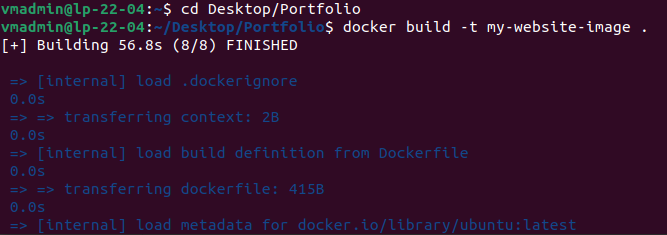
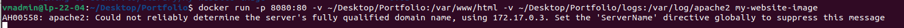
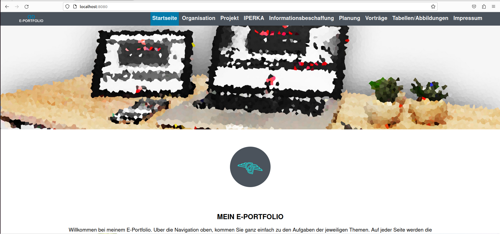

# M347-Mini-Projekt

## Übersicht
Das ist das Repository von Sullivan Renner und Dado Dickovic für das Mini-Projekt im Modul 347.
Es enthält bereits eine Webseite und das Dockerfile.
Es besteht aus den folgenden Hauptordnern:

  - Portfolio (Enthält alle Dateien die für das Erstellen der Images nötig sind)
  - Bilder (Enthält die Bilder für das ReadMe)

## [Dockerfile](./Portfolio/Dockerfile) - Zeile für Zeile erklärt
    FROM ubuntu:latest
Hier wird das Basisimage definiert, auf dessen Grundlage das Docker-Image erstellt werden soll. In diesem Fall ist es das Ubuntu-Linux-Image in der neuesten Version (latest).
 
 

    RUN apt-get update && apt-get install -y apache2 && apt-get clean:
Hier wird das System aktualisiert und der Apache-Webserver installiert. apt-get update aktualisiert das Paket-Repository, apt-get install -y apache2 installiert den Apache-Webserver und apt-get clean löscht die temporären Dateien des Paketmanagers, um die Größe des Images zu reduzieren.
 
 

    COPY index.html /var/www/html/
Hier wird die Datei index.html aus dem Docker-Build-Verzeichnis in das Verzeichnis /var/www/html/ im Container kopiert. Dies ist der Standardpfad für Webseiten-Dateien im Apache-Webserver.
 
 

    EXPOSE 8080
Hier wird definiert, dass der Container Port 8080 nach außen hin öffnen kann, so dass externe Verbindungen auf den Container zugreifen können.
 
 

    CMD ["apache2ctl", "-D", "FOREGROUND"]
Diese Zeile legt den Befehl fest, der ausgeführt wird, wenn der Container gestartet wird. Hier wird der Apache-Webserver im Vordergrundmodus gestartet, so dass er auf eingehende Anforderungen reagieren kann.
 
 

## Portfolio
Das Porfolio wurde von [Dado Dickovic](https://github.com/DadoDiv) im Rahmen einer Abschlussarbeit im Modul 293 entwickelt - [Link zum Git-Repository](https://github.com/DadoDiv/E-Portfolio)

# Vorgehen

## Image erstellen
Zuerst erstellt/kopiert man das Dockerfile in den Porfolio-Ordner.
**Wichtig: Das Dockerfile muss genau Dockerfile heissen (keine Dateiendung)**
Danach geht man in der Konsole in diesen Ordner.
Dort führt man dan folgenden Befehl aus:
    
    docker build -t 'Name' .

Dann wird das Image erstellt. 

## Image starten
Dannach gibt man den folgenden Befehl ein:

    docker run -p 'port':80 -v 'PfadZuOrdner':/var/www/html -v 'PfadZuOrdner'/logs:/var/log/apache2 'ImageName'

Dadurch startet man das Image auf dem angegebenen Port.(Dieser Fehler darf auftreten)

## Überprüfen
Wenn nun alles erledight ist sollte man auf `http://localhost:port'` die Webseite sehen

